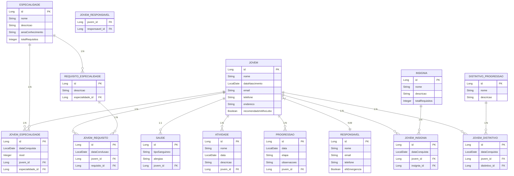

```mermaid
erDiagram
    JOVEM ||--o{ SAUDE : "1:1"
    JOVEM ||--o{ ATIVIDADE : "1:N"
    JOVEM ||--o{ PROGRESSAO : "1:N"
    JOVEM }|--|| RESPONSAVEL : "N:M"
    
    JOVEM ||--o{ JOVEM_ESPECIALIDADE : "1:N"
    ESPECIALIDADE ||--o{ JOVEM_ESPECIALIDADE : "1:N"
    ESPECIALIDADE ||--o{ REQUISITO_ESPECIALIDADE : "1:N"
    
    JOVEM ||--o{ JOVEM_INSIGNIA : "1:N"
    INSIGNIA ||--o{ JOVEM_INSIGNIA : "1:N"
    
    JOVEM ||--o{ JOVEM_DISTINTIVO : "1:N"
    DISTINTIVO_PROGRESSAO ||--o{ JOVEM_DISTINTIVO : "1:N"
    
    JOVEM ||--o{ JOVEM_REQUISITO : "1:N"
    REQUISITO_ESPECIALIDADE ||--o{ JOVEM_REQUISITO : "1:N"

    JOVEM {
        Long id PK
        String nome
        LocalDate dataNascimento
        String email
        String telefone
        String endereco
        Boolean recomendadoVelhoLobo
    }
    
    SAUDE {
        Long id PK
        String tipoSanguineo
        String alergias
        Long jovem_id FK
    }
    
    ATIVIDADE {
        Long id PK
        String nome
        LocalDate data
        String descricao
        Long jovem_id FK
    }
    
    PROGRESSAO {
        Long id PK
        LocalDate data
        String etapa
        String observacoes
        Long jovem_id FK
    }
    
    RESPONSAVEL {
        Long id PK
        String nome
        String email
        String telefone
        Boolean ehEmergencia
    }
    
    JOVEM_RESPONSAVEL {
        Long jovem_id FK
        Long responsavel_id FK
    }
    
    ESPECIALIDADE {
        Long id PK
        String nome
        String descricao
        String areaConhecimento
        Integer totalRequisitos
    }
    
    JOVEM_ESPECIALIDADE {
        Long id PK
        LocalDate dataConquista
        Integer nivel
        Long jovem_id FK
        Long especialidade_id FK
    }
    
    REQUISITO_ESPECIALIDADE {
        Long id PK
        String descricao
        Long especialidade_id FK
    }
    
    JOVEM_REQUISITO {
        Long id PK
        LocalDate dataConclusao
        Long jovem_id FK
        Long requisito_id FK
    }
    
    INSIGNIA {
        Long id PK
        String nome
        String descricao
        Integer totalRequisitos
    }
    
    JOVEM_INSIGNIA {
        Long id PK
        LocalDate dataConquista
        Long jovem_id FK
        Long insignia_id FK
    }
    
    DISTINTIVO_PROGRESSAO {
        Long id PK
        String nome
        String descricao
    }
    
    JOVEM_DISTINTIVO {
        Long id PK
        LocalDate dataConquista
        Long jovem_id FK
        Long distintivo_id FK
    }
```
